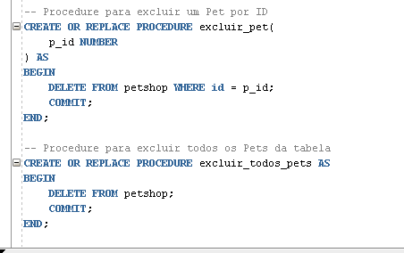

# cp01-DB-2TDSS
## Feito por:

- Heitor Borba Marini RM 92976
- Isa Mary Kusuki Yabiku RM 93307
- Beatriz Torres RM 95838
- Giovana Abreu RM 95896
- Ruan Santos Dias RM 94528

## Sala 2TDSS

## Prints do banco

     
    <h3>Create table</h3>
     
    
    

     
    <h3>Procedures</h3>
     
    
    
    

     
    <h3>Procedures Developer</h3>
     
    
    

     
    <h3>Body Package</h3>
     
    
    

     
    <h3>Trigger</h3>
     
    
    

